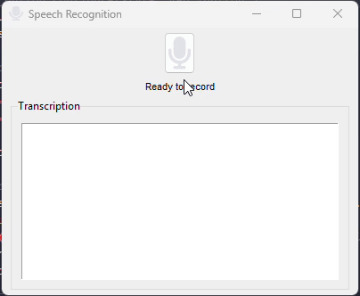

# 🗣️ Persian Speech Recognition

[](LICENSE)
[](https://github.com/IranTechNest/PersianSpeechRecognition/stargazers)
[](https://github.com/IranTechNest/PersianSpeechRecognition/issues)

A Persian (Farsi) speech recognition system designed to convert spoken Persian language into text. This project leverages deep learning models to achieve high-accuracy transcription for Persian speech.


## 🪄 Features

- **Pre-trained models** for Persian speech recognition
- **Dataset support** for training custom models

### 🛠️ Prerequisites
- Python 3.7+
- pip
- (Optional) CUDA for GPU acceleration

## ⚙️ 2 Environment Setup
1. Clone the repository:
   ```bash
   git clone https://github.com/IranTechNest/PersianSpeechRecognition.git 
   ```
    then 

   ```bash
   cd PersianSpeechRecognition
    ```
2. Install dependencies:

    ```bash
    pip install -r requirements.txt 
    ```

## 🚀 Usage
1. Run app:

```bash
 python app.py
```
2. python
 ``` bash
from src.vioce2txt import SpeechRecognition

speech = SpeechRecognition(model='medium')
pred_transcription = speech.speech_recognition("output_audio.wav") 

pred_transcription = [سلام من اومدم یک دو سه چهار]
```


## 🤝 Contributing
We welcome contributions! Please read our Contributing Guidelines before submitting pull requests or issues. my emila is : raminram6970@gmail.com

## 📜 License
This project is licensed under the MIT License - see the LICENSE file for details.

## 🙏 Acknowledgments
Thanks to Mozilla Common Voice for open-source datasets

Inspired by DeepSpeech and HuggingFace Transformers

## 📬 Contact
For questions or support, please open an issue or contact the maintainers at IranTechNest. or raminram6970@gmail.com

## 📌 Citation
``` 
@misc{raminram_persianspeech,
  title        = {PersianSpeechRecognition},
  author       = {Ramin Rahimi},
  howpublished = {\url{https://github.com/IranTechNest/PersianSpeechRecognition}},
  year         = {2025},
  note         = {Accessed: 2025-06-02},
  email        = {raminram6970@gmail.com}
}

